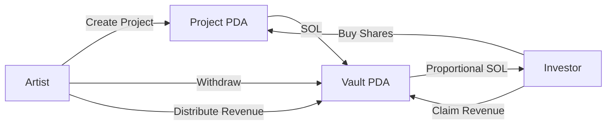
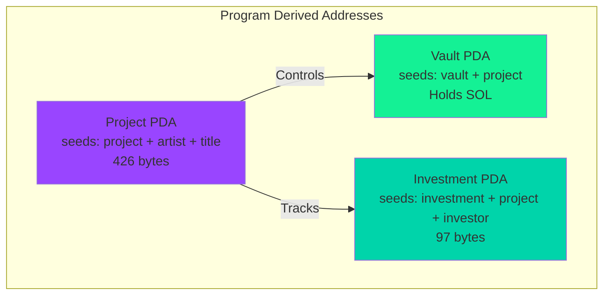
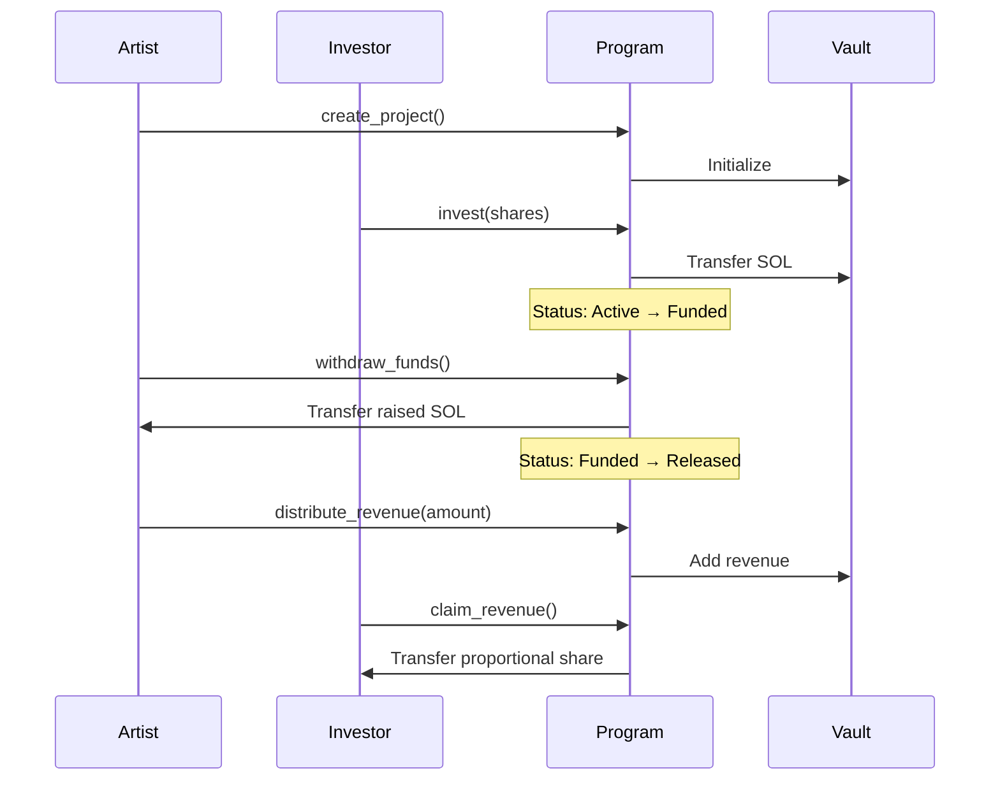

# SoundChain 🎵 — Music Investment on Solana

[](https://solana.com)
[](https://www.anchor-lang.com/)
[](https://nextjs.org/)
[](LICENSE)

A decentralized music investment platform built on Solana devnet for the **Solana LATAM Hackathon**.

Artists raise funds by selling shares in their music projects. Investors earn revenue share when the music generates income — all on-chain, fully transparent.

---

## 🎯 Why Solana?

- **High Performance**: 65,000 TPS enables real-time investment transactions
- **Low Costs**: Sub-cent transaction fees make micro-investments viable
- **PDA Architecture**: Secure, deterministic account management without private keys
- **Anchor Framework**: Type-safe, auditable smart contract development
- **Composability**: Ready for DeFi integrations (DEX, lending, NFTs)

---

## 🏗️ Architecture Overview

### System Flow



### Account Structure



### Transaction Flow



For detailed architecture documentation, see [ARCHITECTURE.md](./ARCHITECTURE.md).

---

## 🚀 How it works

1. **Artist** creates a project with a funding goal, total shares, and revenue share %
2. **Investors** buy shares (SOL goes into a PDA vault)
3. When fully funded, the **artist withdraws** the raised SOL
4. As revenue comes in, the **artist distributes** SOL back to the vault
5. **Investors claim** their proportional revenue share anytime

---

## 📦 Setup

### Prerequisites

```bash
# Install Rust
curl --proto '=https' --tlsv1.2 -sSf https://sh.rustup.rs | sh

# Install Solana CLI
sh -c "$(curl -sSfL https://release.solana.com/v1.18.0/install)"

# Install Anchor
cargo install --git https://github.com/coral-xyz/anchor avm --locked --force
avm install latest && avm use latest

# Install Node deps
npm install
cd app && npm install
```

### Configure wallet

```bash
solana-keygen new --outfile ~/.config/solana/id.json
solana config set --url devnet
solana airdrop 2   # get devnet SOL
```

### Build & Deploy

```bash
# Build the program
anchor build

# Copy the program ID from target/idl/music_investment.json
# Update declare_id! in programs/music_investment/src/lib.rs and Anchor.toml

# Deploy to devnet
anchor deploy --provider.cluster devnet

# Run tests
anchor test
```

### Run the frontend

```bash
cd app
npm run dev
# Open http://localhost:3000
```

After deploying, copy the generated IDL from `target/idl/music_investment.json` into `app/src/utils/idl.ts` and update `PROGRAM_ID`.

---

## 🧪 Testing

```bash
# Run all tests
anchor test

# Run specific test
anchor test -- --grep "Creates a music project"
```

### Test Coverage
- ✅ Project creation with validation
- ✅ Multi-investor scenarios
- ✅ Revenue distribution accuracy
- ✅ Proportional claim calculations
- ✅ State transition validation
- ✅ Access control enforcement

---

## 🎨 Features

### For Artists
- 🎵 Create music projects with custom funding goals
- 💰 Set flexible revenue share percentages
- 📊 Track funding progress in real-time
- 🔓 Withdraw funds when fully funded
- 💸 Distribute revenue to investors transparently

### For Investors
- 🔍 Browse active music projects
- 💎 Buy shares in promising artists
- 📈 Track portfolio performance
- 💵 Claim proportional revenue automatically
- 🌐 View all transactions on Solana Explorer

### Platform
- ⚡ Lightning-fast transactions (< 1 second)
- 🔒 Secure PDA-based architecture
- 📱 Mobile-responsive design
- 🌍 Bilingual support (EN/ES)
- 🎯 Zero platform fees (only network fees)

---

## 🗺️ Roadmap

### Phase 1 (Current - Hackathon)
- ✅ Core investment functionality
- ✅ Revenue distribution system
- ✅ Bilingual UI
- ✅ Comprehensive testing

### Phase 2 (Post-Hackathon)
- 🔜 NFT share certificates
- 🔜 Secondary market for share trading
- 🔜 Multi-signature artist accounts
- 🔜 Time-locked withdrawals
- 🔜 Automated revenue distribution via oracles

### Phase 3 (Future)
- 🔮 DAO governance for platform decisions
- 🔮 Integration with music streaming platforms
- 🔮 Cross-chain bridge support
- 🔮 Mobile app (iOS/Android)

---

## 📄 License

MIT License - see [LICENSE](LICENSE) file for details

---

## 🤝 Contributing

Contributions are welcome! Please feel free to submit a Pull Request.

---

## 📞 Contact

Built with ❤️ for Solana LATAM Hackathon 2024

- **GitHub**: [Your GitHub]
- **Twitter**: [Your Twitter]
- **Discord**: [Your Discord]

---

## 🙏 Acknowledgments

- Solana Foundation for the amazing blockchain infrastructure
- Anchor team for the powerful framework
- Solana LATAM community for the support and inspiration

---

**⚡ Powered by Solana | Built with Anchor | Designed for Artists**

---

## 📋 Program Instructions

| Instruction | Who calls it | Description | Security |
|---|---|---|---|
| `create_project` | Artist | Create a new music project | Title/description length validation, PDA derivation |
| `invest` | Investor | Buy shares in a project | Active status check, share availability, overflow protection |
| `withdraw_funds` | Artist | Withdraw raised SOL after funding goal met | Artist-only, funded status, rent-exempt preservation |
| `distribute_revenue` | Artist | Send revenue to vault for investors | Artist-only, released/funded status |
| `claim_revenue` | Investor | Claim proportional revenue share | Investor-only, proportional calculation, double-claim prevention |

---

## 🔒 Security Features

### Smart Contract Security
- ✅ **PDA-based access control** - No private key management
- ✅ **Math overflow protection** - All arithmetic uses `checked_*` methods
- ✅ **State machine validation** - Strict status transitions
- ✅ **Rent-exempt preservation** - Vault always maintains minimum balance
- ✅ **Input validation** - Length limits, range checks, zero-amount prevention
- ✅ **Event emission** - Full audit trail on-chain

### Account Security
```rust
// Project PDA: Deterministic, collision-resistant
seeds = [b"project", artist.key(), title.as_bytes()]

// Vault PDA: Program-controlled, no external access
seeds = [b"vault", project.key()]

// Investment PDA: Unique per investor per project
seeds = [b"investment", project.key(), investor.key()]
```

---

## 🛠️ Tech Stack

### Smart Contract
- **Language**: Rust
- **Framework**: Anchor 0.30+
- **Network**: Solana Devnet
- **Architecture**: PDA-based account model
- **Testing**: Anchor test suite with Chai assertions

### Frontend
- **Framework**: Next.js 14 (App Router)
- **Language**: TypeScript
- **Styling**: Tailwind CSS + Custom glassmorphism
- **Wallet**: @solana/wallet-adapter (Phantom)
- **State**: React hooks + Anchor Provider
- **i18n**: English + Spanish support

### Key Features
- 🌐 Bilingual UI (EN/ES)
- 🎨 Modern glassmorphism design
- 📱 Responsive mobile-first layout
- ⚡ Real-time blockchain state updates
- 🔔 Toast notifications with transaction links
- 📊 Live statistics dashboard
